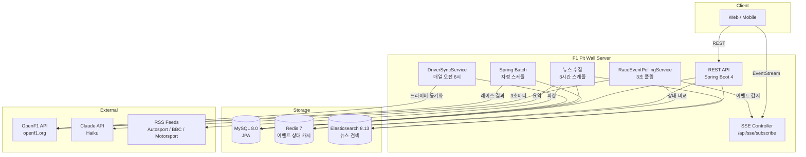

# F1 Pit Wall

F1 실시간 레이싱 데이터 플랫폼. OpenF1 API 폴링 기반 실시간 이벤트 감지, SSE 알림, Spring Batch 데이터 수집, Claude AI 뉴스 요약 기능을 제공합니다.

## Architecture



## Tech Stack

| Category | Stack |
|---|---|
| Language | Java 25 |
| Framework | Spring Boot 4.0.5 |
| Database | MySQL 8.0 (JPA/Hibernate) |
| Cache | Redis 7 |
| Search | Elasticsearch 8.13 |
| Batch | Spring Batch 6 |
| Realtime | SSE (Server-Sent Events) |
| HTTP Client | Spring WebFlux WebClient |
| AI | Claude API (claude-haiku-4-5-20251001) |
| RSS | Rome 2.1.0 |
| Auth | JWT (Access + Refresh Token Rotation) |
| Test | JUnit 5 + Testcontainers |
| Deploy | Docker + GitHub Actions + AWS EC2 |

## Features

### 실시간 이벤트 감지 (Phase 5)
- OpenF1 API를 3초마다 폴링하여 레이스 이벤트 감지
- Redis에 이전 상태를 캐싱하여 변화 감지
- 구독 드라이버 기준 유저 필터링 후 SSE 푸시
- 감지 이벤트: 순위 변동 / 피트스톱 / 세이프티카 / VSC

### Spring Batch 자동 수집 (Phase 4)
- `RaceResultCollectJob` — 레이스 결과 + F1 포인트 계산
- `PitStopCollectJob` — 피트스톱 기록 수집
- `DriverStandingUpdateJob` — 챔피언십 순위 갱신
- 매일 자정 스케줄, 전날 레이스 완료 여부 확인 후 실행

### 뉴스 AI 요약 (Phase 6)
- Autosport / BBC Sport / Motorsport.com RSS 수집 (3시간 주기)
- Claude Haiku API로 한국어 3문장 요약 생성
- 드라이버·팀 키워드 자동 태깅
- Elasticsearch 전문 검색

### 드라이버 동적 동기화
- 매일 오전 6시 OpenF1에서 현재 시즌 드라이버 목록 동기화
- 루키 등록 / 리저브 드라이버 교체 자동 반영

## Quick Start

### Prerequisites
- Docker & Docker Compose
- Java 25 (로컬 빌드 시)

### Local Development

```bash
# 인프라 실행
docker compose up -d

# 앱 실행
./gradlew bootRun
```

### Environment Variables

`.env.example`을 복사하여 `.env` 파일 생성 후 값을 채웁니다.

```bash
cp .env.example .env
```

| Variable | Description |
|---|---|
| `MYSQL_ROOT_PASSWORD` | MySQL root 패스워드 |
| `JWT_SECRET` | JWT 서명 시크릿 (32자 이상) |
| `CLAUDE_API_KEY` | Anthropic Claude API 키 |

## API Endpoints

### Auth
| Method | Path | Description |
|---|---|---|
| POST | `/api/auth/signup` | 회원가입 |
| POST | `/api/auth/login` | 로그인 |
| POST | `/api/auth/refresh` | 토큰 재발급 |
| POST | `/api/auth/logout` | 로그아웃 |

### Drivers
| Method | Path | Description |
|---|---|---|
| GET | `/api/drivers` | 드라이버 목록 |
| GET | `/api/drivers/{id}` | 드라이버 상세 |

### Races
| Method | Path | Description |
|---|---|---|
| GET | `/api/races?season=` | 레이스 목록 |
| GET | `/api/races/{id}` | 레이스 상세 |
| GET | `/api/races/{id}/results` | 레이스 결과 |
| GET | `/api/races/{id}/pitstops` | 피트스톱 기록 |
| GET | `/api/races/live` | 실시간 순위 |

### Standings
| Method | Path | Description |
|---|---|---|
| GET | `/api/standings/drivers?season=` | 드라이버 챔피언십 순위 |

### User (인증 필요)
| Method | Path | Description |
|---|---|---|
| GET | `/api/users/me` | 내 정보 |
| GET | `/api/users/me/drivers` | 구독 드라이버 목록 |
| POST | `/api/users/me/drivers/{driverId}` | 드라이버 구독 |
| DELETE | `/api/users/me/drivers/{driverId}` | 구독 해제 |

### News
| Method | Path | Description |
|---|---|---|
| GET | `/api/news` | 최신 뉴스 목록 |
| GET | `/api/news/{id}` | 뉴스 상세 |
| GET | `/api/news/drivers/{code}` | 드라이버별 뉴스 |
| GET | `/api/news/search?q=` | 뉴스 검색 |

### SSE (인증 필요)
| Method | Path | Description |
|---|---|---|
| GET | `/api/sse/subscribe` | 실시간 이벤트 구독 |

## CI/CD

```
Push to main
    └── GitHub Actions
            ├── Test (JUnit + Testcontainers)
            ├── Build JAR
            ├── Build & Push Docker image → Docker Hub
            └── SSH Deploy → EC2
                    └── docker compose pull & up
```

### Required GitHub Secrets

| Secret | Description |
|---|---|
| `DOCKERHUB_USERNAME` | Docker Hub 사용자명 |
| `DOCKERHUB_TOKEN` | Docker Hub Access Token |
| `EC2_HOST` | EC2 퍼블릭 IP |
| `EC2_USER` | EC2 SSH 사용자 (ec2-user / ubuntu) |
| `EC2_SSH_KEY` | EC2 SSH 개인키 |

## Testing

```bash
# 전체 테스트 실행 (Testcontainers — Docker 필요)
./gradlew test
```

테스트 구조:
```
support/AbstractIntegrationTest  ← MySQL + Redis Testcontainers 공통 베이스
    ├── AuthServiceIntegrationTest    (6개)
    ├── UserServiceIntegrationTest    (5개)
    ├── RaceResultCollectJobTest      (2개)
    └── F1ApplicationTests            (1개)

RaceEventPollingServiceTest           (5개, Mockito 단위테스트)

총 19개 테스트
```
